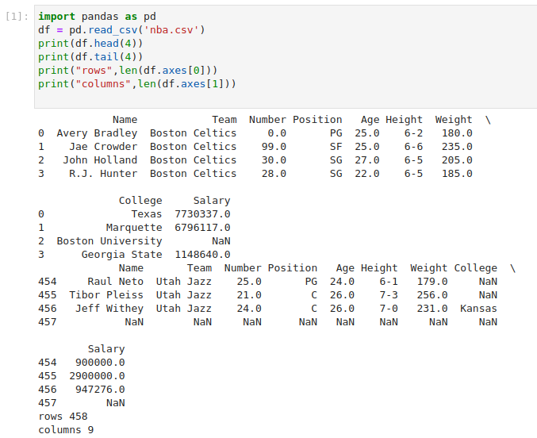

# Read-from-CSV

## AIM:
To write a python program for reading content from a CSV file.


## ALGORITHM:
### Step 1:Import pandas as pd.
### Step 2:Read the CSV file using read_csv method.
### Step 3:Use head and tail method to get the required contents from the file.
### Step 4:Use len() method to get the number of rows and columns
### Step 5:Print the output.

## PROGRAM:
```To write a python program for reading content from a CSV file.
Developed by:  S.E.Elamaran
Register Number: 22000420

import pandas as pd
df = pd.read_csv('data1.csv')
print(df.head(4))
print(df.tail(4))
print("Number of rows:",len(df.axes[0]))
print("Number of columns:",len(df.axes[1]))
```


## OUTPUT:


## RESULT:
Thus a python program is written to read the contents of a CSV file.


